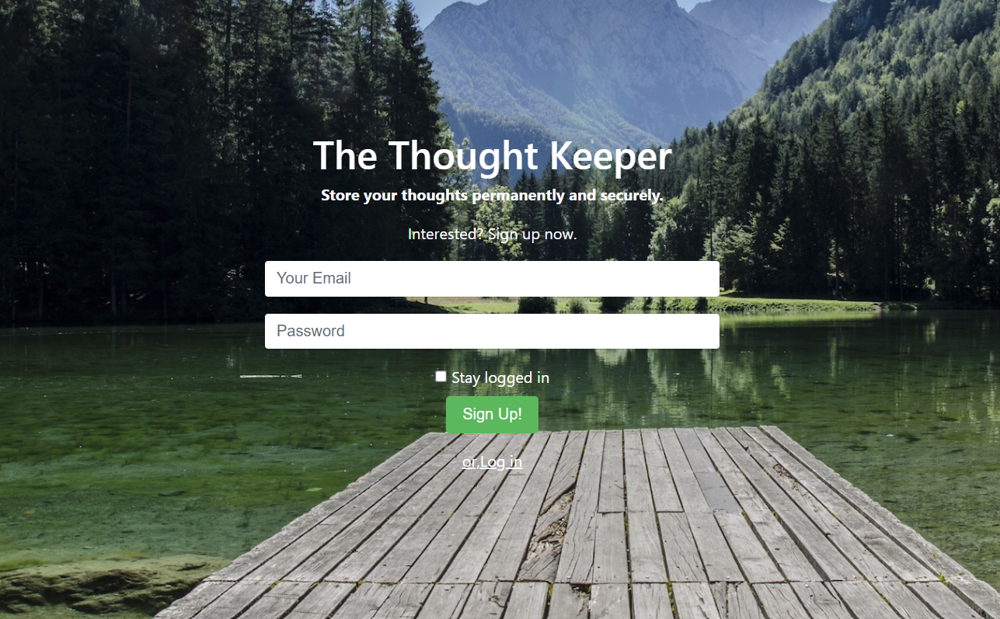
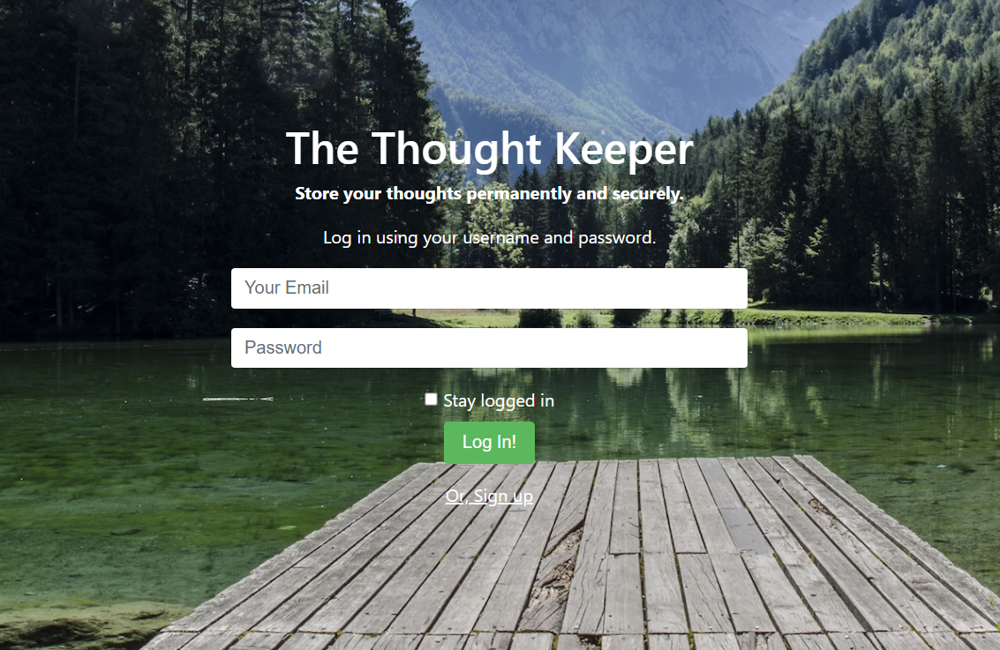
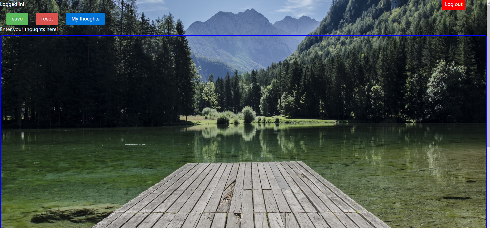

# The-Thought-Keeper
The Thought Keeper is a responsive full-stack web application, where the user stores his thoughts safe and securely. The user passwords are protected using md5 hashing.

Tech Stack: php, mysql, bootstrap4, HTML 5 and CSS 3

<h2>Features</h2>

<ul>
  <li>All the passwords are stored safely using md5 hashing </li>
  
  <li>Login and sign up validations is done both in front-end(javascript) and back-end(php) </li>
  
  <li>session variables are assigned when stay logged in checkbox clicked. If that check box is clicked, the user stays logged in utlil manually logs off. Once the user click log off then session variables are unset </li>
  
  <li> While sign up it checks for if the user already exists or aren't </li>
  
  <li>While logging in, the user entered password is md5 hashed and compares with it in the databes </li>
  
  <li>A nice error and success messages are displayed </li>
  
  <li> once logged in the user is directed to the thought entry page. where it has a logout button and a text field. He can enter his thoughts in the text field which is automatically saved in the data base. </li>
  
  </ul>
    
<h2> Application </h2>
    
 <h3> Sign up page </h3>

    
 <h3>Login In page </h3>

    
<h3>Logged In page </h3>   

<h2>In action </h2>

 see this application in action <a href="http://jayasampathwebhosting-com.stackstaging.com/projects/thought-keeper/">here </a>

